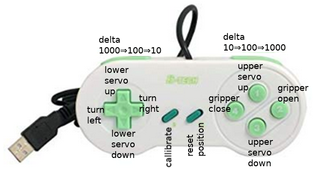

# 4DoF robot arm

* [Introduction](#introduction)
* [Construction](#construction)
* [Wiring diagram](#wiring-diagram)
* [Tools](#tools)
  * [tools/gamepad](#toolsgamepad)
  * [pigpio pigs scripts](#pigpio-pigs-scripts)
    * [die picker](#die-picker)
    * [4 servos moving simultaneously](#4-servos-moving-simultaneously)
* [Adding camera near gripper](#adding-camera-near-gripper)

## Introduction

This blog is on this 15$ [4DoF robot arm](https://www.banggood.com/Small-Hammer-3D-Print-DIY-4DOF-RC-Robot-Arm-Kit-With-SG90-Servos-p-1451689.html).

Work in progress ... here some teaser animations:

 

## Construction

There are no instructions for building the robot arm in packet received, nor on [product website](https://www.banggood.com/Small-Hammer-3D-Print-DIY-4DOF-RC-Robot-Arm-Kit-With-SG90-Servos-p-1451689.html). But building was possible by looking at the many photos of robot arm shown on product website.  

I had to do a lot of sandpaper work in order to get movable gripper parts slide on the board screwed onto top servo motor.  

What was really bad is that the diameter of the gearwheel connector did not fit into the hole of 3D printed robot arm ground plate. I did cut the one arm of gearwheel connector, then did put it on ground servo gearwheel, and screwed it with small screw. Then I took out my Dremel and removed material as long as needed to be able to press the robot arm ground plate on the prepared gearwheel connector. For seeing details of 5MP photo you have to right click:  

Even really firmly screwing the big 3D printed gripper gearwheel onto the small top servo gearwheel leaves too much play for recreatable big gearwheel position wrt servo motor position. I solved that issue by putting two drops of superglue onto big 3D printed gearwheel before connecting with small servo gearwheel -- not perfect, but works.

## Wiring diagram

A colleague told me to use powerrail in order to avoid voltage drop problems:  
https://youtu.be/qc0d_gW480I  
  

This is connection diagram:  
  

## Tools

### tools/gamepad

Tool [tools/gamepad](tools/gamepad) allows to control 4DoF robot arm with (SNES) gamepad.  
All 8 buttons as well as all 4 axis buttons have functions:  

### pigpio pigs scripts

Hard coded sample scripts can be easily done using pigpio library's [pigs command](http://abyz.me.uk/rpi/pigpio/pigs.html), especially: 

    ...
    S/SERVO u v - Set GPIO servo pulsewidth
    
    This command starts servo pulses of v microseconds on GPIO u.  
    ...

Setting of 500/1500/2500 corresponds to 0°/90°/180° for servo motor.

#### die picker

This is the script executed for die picking demo, Pi GPIO8/9/10/11 controls robot arm gripper/top/bottom/pan servo:

    pi@raspberrypi3Bplus:~ $ cat doit
    #!/bin/sh
    pigs s 11 1500; pigs s 8 2100; sleep 0.5
    pigs s 10 2500; pigs s 9 1900; sleep 0.5
    pigs s 8 1500; sleep 0.5
    pigs s 9 1500; pigs s 10 1500; sleep 0.5
    pigs s 9 2500; pigs s 11 2500; sleep 0.5
    pigs s 8 2200
    pi@raspberrypi3Bplus:~ $

 

#### 4 servos moving simultaneously

These are the pigs commands for what you see in below animation, from:  
https://www.youtube.com/watch?v=qc0d_gW480I

    ...
    pigs s 11 2000; pigs s 10 2000; pigs s 9 2000; pigs s 8 2000; sleep 0.6
    pigs s 11 1000; pigs s 10 1000; pigs s 9 1000; pigs s 8 1000; sleep 0.6
    pigs s 11 1500; pigs s 10 1500; pigs s 9 1500; pigs s 8 1500; sleep 2
    pigs s 11 1000; pigs s 10 1000; pigs s 9 1000; pigs s 8 1000; sleep 0.3
    pigs s 11 1500; pigs s 10 1500; pigs s 9 1500; pigs s 8 1500; sleep 0.3
    pigs s 11 2000; pigs s 10 2000; pigs s 9 2000; pigs s 8 2000; sleep 0.3
    pigs s 11 1000; pigs s 10 1000; pigs s 9 1000; pigs s 8 1000; sleep 0.3
    pigs s 11 1500; pigs s 10 1500; pigs s 9 1500; pigs s 8 1500
    ...

## Adding camera near gripper

TBD
